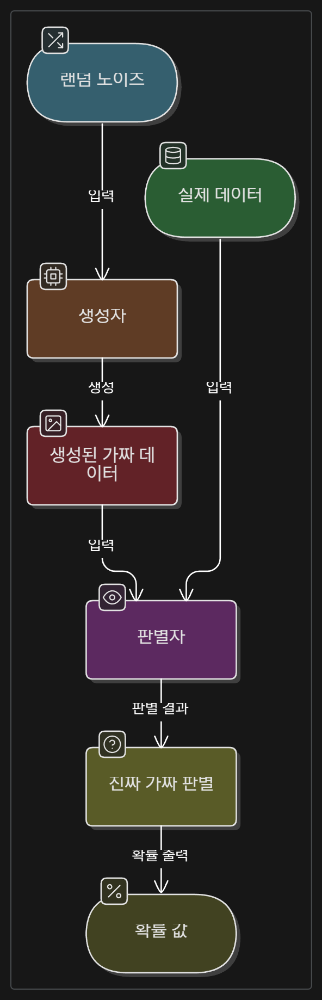
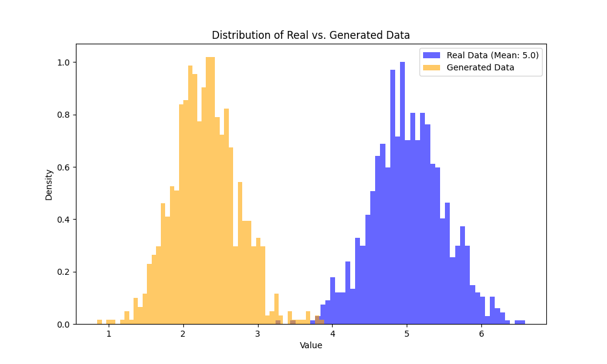

# 생성적 적대 신경망 (Generative Adversarial Network, GAN) 예제 (1D 데이터)

이 디렉토리에는 1차원 데이터를 생성하는 간단한 GAN 알고리즘을 Python과 TensorFlow/Keras로 구현한 예제(`gan.py`)가 포함되어 있습니다.

## 1. GAN (생성적 적대 신경망) 이란?

GAN은 두 개의 신경망, 즉 생성자(Generator)와 판별자(Discriminator)가 서로 경쟁하며 학습하는 딥러닝 모델입니다. 이 경쟁 과정은 다음과 같이 비유할 수 있습니다:

*   **생성자 (위조지폐범)**: 진짜와 최대한 유사한 가짜 데이터를 만들려고 노력합니다.
*   **판별자 (경찰)**: 주어진 데이터가 진짜인지 생성자가 만든 가짜인지 구별하려고 노력합니다.

학습이 진행됨에 따라 생성자는 더욱 정교한 가짜 데이터를 만들고, 판별자는 더욱 정확하게 진짜와 가짜를 구별하게 됩니다. 이 과정을 통해 생성자는 실제 데이터와 매우 유사하여 판별자가 구분하기 어려운 데이터를 생성할 수 있게 됩니다.

## 2. `gan.py` 코드 설명

### 2.1. 주요 의존성 (Dependencies)

스크립트를 실행하기 위해 다음 라이브러리가 필요합니다:

*   **TensorFlow**: 딥러닝 모델 (신경망)을 구성하고 학습하는 데 사용됩니다.
*   **NumPy**: 효율적인 수치 계산, 특히 배열 연산에 사용됩니다.
*   **Matplotlib**: 학습 결과를 시각화하기 위해 (데이터 분포도 그리기) 사용됩니다.

다음 명령어로 설치할 수 있습니다:
```bash
pip install tensorflow matplotlib numpy
```

### 2.2. 주요 파라미터

스크립트 상단에서 몇 가지 주요 파라미터를 설정합니다:

*   `NOISE_DIM`: 생성자 입력으로 사용될 노이즈 벡터의 차원 (예: 10).
*   `DATA_DIM`: 생성할 데이터의 차원 (이 예제에서는 1차원).
*   `REAL_DATA_MEAN`, `REAL_DATA_STDDEV`: 실제 데이터가 따를 정규분포의 평균과 표준편차.

### 2.3. 생성자 (Generator) - `build_generator` 함수

생성자는 무작위 노이즈로부터 가짜 데이터를 생성합니다.

*   **입력**: `NOISE_DIM` 차원의 노이즈 벡터.
*   **출력**: `DATA_DIM` 차원의 데이터 (이 예제에서는 1차원 실수 값).
*   **구조 (예시)**:
    ```
    Input (Noise, 예: 10차원)
      ↓
    Dense(32) + LeakyReLU + BatchNormalization
      ↓
    Dense(64) + LeakyReLU + BatchNormalization
      ↓
    Dense(1, activation='linear') → Output (1차원 데이터)
    ```
    (BatchNormalization은 학습 안정화에 도움을 줄 수 있습니다.)

### 2.4. 판별자 (Discriminator) - `build_discriminator` 함수

판별자는 입력된 데이터가 실제 데이터인지 생성자가 만든 가짜 데이터인지 판별합니다.

*   **입력**: `DATA_DIM` 차원의 데이터 (실제 또는 가짜).
*   **출력**: 입력 데이터가 실제일 확률 (0과 1 사이의 값, 1에 가까울수록 진짜).
*   **구조 (예시)**:
    ```
    Input (1차원 데이터)
      ↓
    Dense(64) + LeakyReLU
      ↓
    Dense(32) + LeakyReLU
      ↓
    Dense(1, activation='sigmoid') → Output (확률)
    ```

### 2.5. GAN 모델 결합 - `build_gan` 함수

생성자와 판별자를 결합하여 전체 GAN 모델을 구성합니다.

*   생성자의 출력이 판별자의 입력으로 연결됩니다.
*   GAN 모델을 학습시킬 때는 **판별자의 가중치는 고정**됩니다 (`discriminator.trainable = False`). 오직 생성자의 가중치만 업데이트되어, 생성자가 판별자를 더 잘 속이도록 학습됩니다.

### 2.6. 실제 데이터 준비 - `get_real_samples` 함수

학습에 사용될 실제 데이터는 NumPy를 사용하여 특정 평균(`REAL_DATA_MEAN`)과 표준편차(`REAL_DATA_STDDEV`)를 갖는 정규분포에서 샘플링됩니다.

### 2.7. 학습 과정 - `train_gan` 함수

GAN의 학습은 다음 두 단계를 번갈아 수행합니다:

1.  **판별자 학습**:
    *   실제 데이터(`real_samples`)에는 레이블 1 (진짜)을 부여합니다.
    *   생성자가 만든 가짜 데이터(`fake_samples`)에는 레이블 0 (가짜)을 부여합니다.
    *   판별자가 이 두 종류의 데이터를 잘 구별하도록 학습시킵니다. (손실 함수: `binary_crossentropy`)

2.  **생성자 학습 (GAN 모델 학습)**:
    *   생성자에게 새로운 노이즈를 입력하여 가짜 데이터를 생성하게 합니다.
    *   이 가짜 데이터를 판별자에게 입력으로 주되, **레이블을 1 (진짜)로 설정**합니다.
    *   GAN 모델 전체를 학습시킵니다. 이때 판별자의 가중치는 고정되어 있으므로, 생성자만 학습됩니다. 생성자는 판별자가 가짜 데이터를 진짜라고 착각하도록 (즉, 판별자의 출력이 1에 가깝도록) 가중치를 업데이트합니다. (손실 함수: `binary_crossentropy`)

이 과정이 지정된 `epochs` 수만큼 반복됩니다. 중간중간 (`sample_interval` 마다) 현재까지 생성된 샘플과 손실 값이 출력됩니다.

### 2.8. 메인 실행 블록 - `if __name__ == '__main__':`

스크립트가 직접 실행될 때 다음 작업이 수행됩니다:
1.  생성자, 판별자, GAN 모델을 빌드합니다.
2.  모델들의 요약 정보를 출력합니다.
3.  `train_gan` 함수를 호출하여 GAN 학습을 시작합니다. (예제에서는 1000 에포크)
4.  학습 완료 후, 최종적으로 생성된 샘플 몇 개를 출력합니다.
5.  Matplotlib을 사용하여 실제 데이터의 분포와 생성된 데이터의 분포를 히스토그램으로 비교하는 플롯을 `scripts/gan_example/gan_generated_data_distribution.png` 파일로 저장합니다.

## 3. GAN 아키텍처 시각화

GAN의 전체적인 데이터 흐름은 다음과 같이 표현할 수 있습니다:




**`gan_generated_data_distribution.png` 파일 설명:**

`gan.py` 스크립트를 실행하면 `scripts/gan_example/` 디렉토리에 `gan_generated_data_distribution.png`라는 이름의 이미지 파일이 생성됩니다. 이 플롯은 다음 두 가지 데이터 분포를 히스토그램으로 보여줍니다:

*   **실제 데이터 분포 (파란색)**: `np.random.normal`로 생성된, 목표로 하는 데이터의 분포입니다.
*   **생성된 데이터 분포 (주황색)**: 학습된 생성자가 만들어낸 데이터의 분포입니다.

학습이 잘 진행될수록 주황색 분포(생성된 데이터)가 파란색 분포(실제 데이터)의 모양과 유사해지는 것을 기대할 수 있습니다. 이는 생성자가 실제 데이터의 특징을 성공적으로 학습했음을 의미합니다.

## 4. 예제 실행 방법

1.  터미널 또는 명령 프롬프트를 엽니다.
2.  저장소의 루트 디렉토리에서 다음 명령어를 사용하거나, `scripts/gan_example` 디렉토리로 이동 후 `python gan.py`를 실행합니다.
    ```bash
    python scripts/gan_example/gan.py
    ```
3.  스크립트가 실행되면 다음 사항들이 진행됩니다:
    *   TensorFlow 및 CUDA 관련 메시지 (GPU 사용 가능 여부 등).
    *   모델 구조 요약 출력.
    *   "Starting GAN training for N epochs..." 메시지와 함께 학습 시작.
    *   일정 간격(`sample_interval`)마다 에포크 번호, 판별자 손실(D loss), 판별자 정확도(Acc), 생성자 손실(G loss) 및 생성된 샘플 데이터가 콘솔에 출력됩니다.
    *   학습 완료 후 "GAN Training Finished." 메시지 출력.
    *   최종 생성된 샘플 몇 개 출력.
    *   `scripts/gan_example/gan_generated_data_distribution.png` 파일이 생성되었다는 메시지 출력.

## 5. 필요 라이브러리 설치

만약 필요한 라이브러리가 설치되어 있지 않다면, 다음 명령어를 사용하여 설치할 수 있습니다:

```bash
pip install tensorflow matplotlib numpy
```
NumPy는 보통 TensorFlow나 Matplotlib 설치 시 자동으로 함께 설치됩니다.
